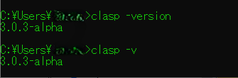
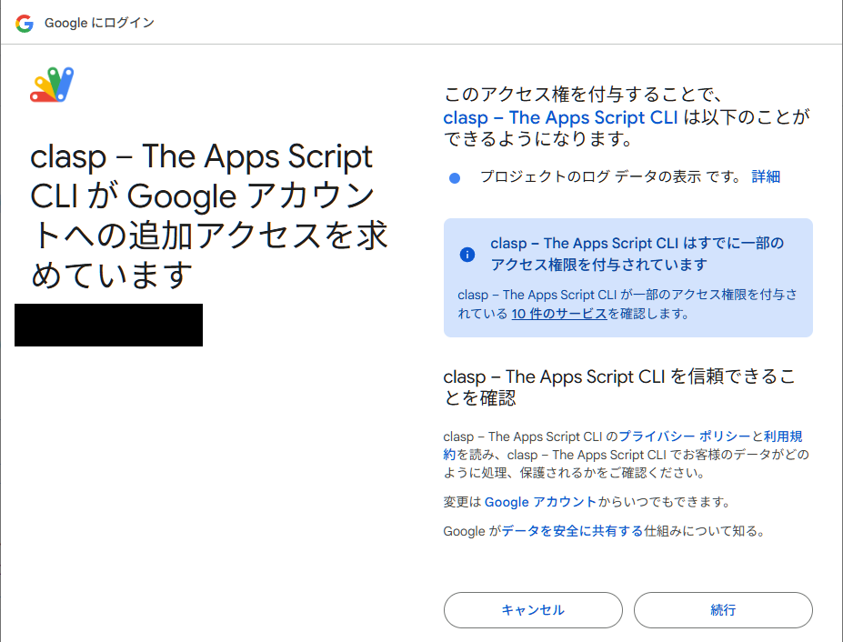
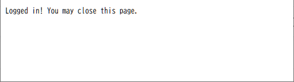

<!-- "/css/primer.css" -->

<!--
GitHubのMarkdown用のcssをぶっこ抜こう：https://qiita.com/__mick/items/c80fab6c185a41882880
Markdownでスタイルシート：https://qiita.com/skkzsh/items/99e30bbbfe69f379b583
マークダウンのコードブロックにファイル名を表示：https://geniusium.hatenablog.com/entry/2022/09/03/230551
MPEコードブロック活用法：https://github.com/shd101wyy/markdown-preview-enhanced/blob/master/docs/ja-jp/code-chunk.md
-->

# Clasp 備忘録

---

## 目次

- [Clasp 備忘録](#clasp-備忘録)
  - [目次](#目次)
  - [インストール](#インストール)
  - [ログイン](#ログイン)
  - [プロジェクト作成](#プロジェクト作成)
    - [type オプション](#type-オプション)
    - [title オプション](#title-オプション)
    - [rootDir オプション](#rootdir-オプション)
    - [parentId オプション](#parentid-オプション)
  - [プロジェクト作成例](#プロジェクト作成例)
    - [Clasp + TypeScript + Jest を用いたスプレッドシートプロジェクト](#clasp--typescript--jest-を用いたスプレッドシートプロジェクト)
      - [開発手順](#開発手順)

---

Claspの公式サイト：https://github.com/google/clasp

---

## インストール

`npm`を利用する。

```txt
npm install -g @google/clasp
```

グローバル環境へのインストールのため、`-g`オプションを利用する。
googleのリポジトリにあるため、`@google`を頭に付ける。

またインストール実行後は、Claspのインストールができているかチェックをする。

```txt
clasp -version  // バージョン確認
clasp -v        // オプションのエイリアス
```

`実行例`


[目次へ戻る↑](#目次)

---

## ログイン

インストール完了後に`login`を行い、Googleアカウントへのログインならびに権限の承認を行う。

```txt
clasp login
```

上記コマンド実行後、下記画像のようにブラウザのタブが開き、ログインするアカウントを選択する画面が表示される。


アクセス権の承認を要求されるので、承認をする（画像は承認済み）



承認が完了すると下記の画面が表示されるので、タブを閉じる。



[目次へ戻る↑](#目次)

---

## プロジェクト作成

Claspから新規のGASプロジェクトを作成する方法。
下記が`clasp create`コマンドでサポートされているオプションとなる。

`clasp create-script　[--type <project type>]　[--title <title>]　[--rootDir <dir name>]　[--parentId <id>]`
`clasp create　[--type <project type>]　[--title <title>]　[--rootDir <dir name>]　[--parentId <id>]`

### type オプション

プロジェクトの種類を指定する。指定しなければ`standalone`でプロジェクトが作成される。

> プロジェクトの種別

- `standalone`</br>&emsp;単体のGASプロジェクトを作成する。
- `docs`</br>&emsp;Google Document(文書)ファイルをコンテナとしたGASプロジェクトを作成する。
- `sheets`</br>&emsp;Google Spreadsheet(表計算)ファイルをコンテナとしたGASプロジェクトを作成する。
- `slides`</br>&emsp;Google Slide(プレゼンテーション)ファイルをコンテナとしたGASプロジェクトを作成する。
- `forms`</br>&emsp;Google Forms(フォーム)ファイルをコンテナとしたGASプロジェクトを作成する。
- `webapp`</br>&emsp;WebアプリケーションのGASプロジェクトを作成する。
- `api`</br>&emsp;APIのGASプロジェクトを作成する。

> cmd

```txt
clasp create --type standalone  // スタンドアロンプロジェクトの作成。
clasp create --type sheets      // スプレッドシート内臓のGASプロジェクト作成。
```

### title オプション

プロジェクトの名前を指定する。指定しなければ作成したディレクトリの名前がドライブに上げられる。
もし、プロジェクトを作成したディレクトリの名前が`Test`であれば、下記の例のようになる。

> cmd

```txt
clasp create
```

`Google Drive`


さらに`SheetTest`でプロジェクトを作成した場合

> cmd

```txt
clasp create --title "TestScript"
```

`Google Drive`


### rootDir オプション

プロジェクトのルートディレクトリを指定する。
一般的にはそのままデプロイする場合は`dist`ディレクトリを作成し、そこにファイルを置く。
`TypeScript`などでビルドする場合は、`src`ディレクトリを作成してファイルを置く。

> cmd

```txt
mkdir dist  // "dist"ディレクトリを生成
clasp create --type sheet --rootDir ./dist
```

`--rootDir`を指定することにより、指定したディレクトリの内部へ`appscript.json`が埋め込まれる。

> ディレクトリ構成

```txt
Test
├ dist
│ └ appscript.json
└ .clasp.json
```

`--rootDir`を指定しない場合。

> ディレクトリ構成

```txt
Test
├ .clasp.json
└ appscript.json
```

### parentId オプション
  
`--parentId`ドライブ内の親となるフォルダのIDを指定する。
指定しないとドライブの直下へ作成される。
先に置いておくべきフォルダが決まっている場合に利用することが想定される。

> コマンドプロンプト

```txt
clasp create --parentId "1QBhVTPluB6KSb9MURtSjMe2cFQ1JxPu_"
```

親フォルダ


作成後


---

## プロジェクト作成例

下記にClaspを用いたGASプロジェクトの参考例を提示する。

### Clasp + TypeScript + Jest を用いたスプレッドシートプロジェクト

- `Clasp`</br>&emsp;GASプロジェクトのローカル開発用CLIツール
- `TypeScript`</br>&emsp;静的型付けによる型安全性を重視したJavaScript用の専用言語
- `Jest`</br>&emsp;JavaScript用テストツール

#### 開発手順

まず任意の開発用ディレクトリを作成する

```txt
mkdir gas-project-ts-jest   // ここでは"gas-project-ts-jest"というディレクトリを作成
```

作成したディレクトリへ移動する

```txt
cd gas-project-ts-jest
```

Gitを初期化する

```txt
git init
```

ドキュメントとなる`README.md`(説明書のようなもの)を作成。

```txt
type nul > README.md
```

npmを初期化する

```txt
npm init -y   // 通常このコマンドの後は対話形式になるが、全てスキップするために"-y"をつける。
```

各種パッケージのインストール

- TypeScriptのインストール

  ```txt
  npm install -D typescript   // "-D"オプションは開発環境のみの利用で稼働環境へのデプロイを行わないときに使用する。
  ```

- Jestのインストール
  - jest
  - @types/jest
  - @swc/core
  - @swc/jest

  ```txt
  npm install -D jest @types/jest @swc/core @swc/jest
  ```

- GASの型定義ファイルのインストール

  ```txt
  npm install -D @types/google-apps-script
  ```

`tsconfig.json`の生成

```txt
npx tsc -init
```

> tsconfig.json

```json
{
  "compilerOptions": {
    "target": "esnext",
    "module": "commonjs",
    "rootDir": "./src",
    "outDir": "./dist",
    "lib": ["ESNext"],
    "experimentalDecorators": true    
  }
}
```


> .clasp.json

```json
{
  "timeZone": "America/New_York",
  "dependencies": {
  },
  "expectionLogging": "STACKDRIVER",
  "runtimeVersion": "V8"
}
```

> appscript.json

```json
{
  "scriptId": "xxxxxxxxxxxxxxxxxxxxxxxxxxxxxxxxxxxxxxxxxxxxxxx",
  "rootDir": "",
  "parentId": "XXXXXXXXXXXXXXXXXXXXXXXXXXXXXXXXX",
  "scriptExtensions": [
    ".js",
    ".gs"
  ],
  "htmlExtensions": [
    ".html"
  ],
  "jsonExtensions": [
    ".json"
  ],
  "filePushOrder": [],
  "skipSubdirectories": false
}
```
