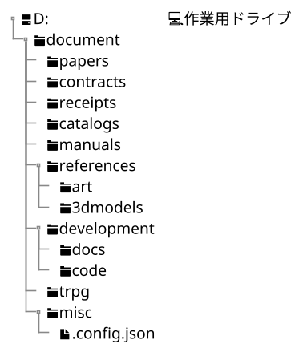
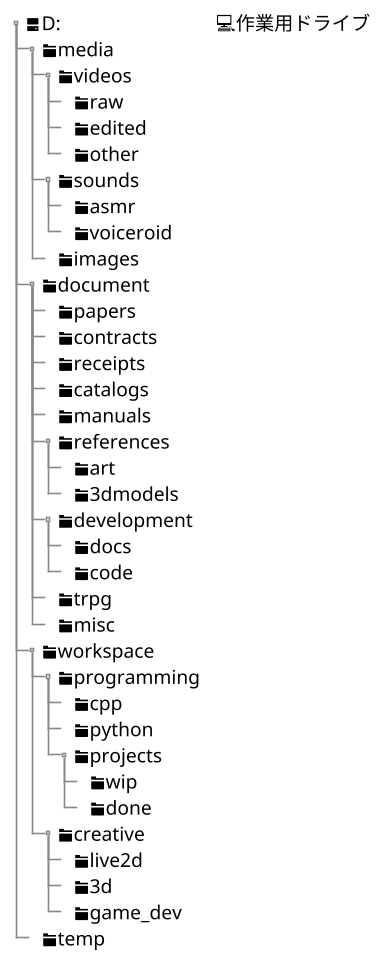

やあ！`current-directory.puml`を拝見しました。現在のディレクトリ構成、確かにかなりバラエティ豊かで、いろんな用途が混在していますね！
動画編集、開発、ゲーム、書類管理など、幅広い活動を反映したカオスさが感じられます（良い意味で！）。
以下に、構成全体と子階層を分析した**所見・感想**、**メリット**、**デメリット**、そして**改善提案**をまとめます。
過去の会話や`environment_structure.md`のやり取りを踏まえ、シンプルさ、一貫性、スケーラビリティを重視したフィードバックにします。

---

### 全体の所見・感想
このディレクトリ構成は、**多趣味で多目的なPC利用**を反映しています。動画編集（`E:\`の`MOV_Edit`）、クリエイティブ作業（`F:\`の`CREATE`）、開発や仕事関連（`G:\`の`Work`）、ゲーム（`J:\`の`GAME`）など、用途が明確にドライブ単位で分離されているのは良い点です。ただし、フォルダ命名や階層構造に一貫性がなく、フォルダ名（例: `00_other_videos`, `_tmp`）や深い階層（例: `G:\10_Project\10_mecanic`）が混乱を招くリスクがあります。雑多なフォルダ（`tmp`, `_oth`）も多く、整理の余地が大きい印象です。

過去の会話から、C/C++/C#などのプログラミングやTRPG、書類管理（論文、契約書など）に興味があることが伺えるので、これらを効率的に管理できる構成を目指すと良さそうです。以下、詳細な分析と提案です。

---

### メリット
1. **ドライブ単位の用途分離**
- `E:\`（動画編集）、`F:\`（クリエイティブ）、`G:\`（仕事・開発）、`J:\`（ゲーム）と、ドライブごとに役割が分かれている。データ保護やバックアップの観点で合理的。
- `C:\`をシステム専用に保つ方針は、OSのクリーンさを維持し、再インストール時の手間を軽減。

2. **細やかなカテゴリ分け**
- `E:\20_sound`（`ASMR`, `ボイロ EXボイス`など）や`F:\10_data`（`clip`, `psd`, `live2d`）は、特定の作業（音声編集、Live2D、3Dモデリング）に特化しており、クリエイティブ作業を効率化。
- `G:\11_Document`（`class_diagram`, `ストアドプロシージャ`など）は、開発関連の書類を細かく分類。プログラミングやデータベース管理に役立つ。

3. **趣味の反映**
- `J:\`の`DMMGame`、`SteamLibrary`、`00_make_game`や、`F:\80_books`（`kindle_books`, `trpg`）は、ゲームやTRPG、電子書籍の趣味を反映。個人利用に最適化されている。

4. **開発環境の考慮**
- `G:\20_Program`の`cpp`, `java`, `python`など、言語ごとのフォルダは開発者にとって直感的。`21_DB`（`dolt`, `_query`）もデータベース作業を意識した良い構造。

---

### デメリット
1. **命名の一貫性不足**
- フォルダ名が混在（例: `00_other_videos`は数字＋英単語、`アンゴラたちの踊り`は日本語、`2E709EF9-7475-45ee-8CCC-0C6212635299`はGUID）。検索や視覚的な整理が難しい。
- アンダースコア（`_`）の多用（`_tmp`, `_oth`, `_data`）や、`tmp`の複数存在（`E:\tmp`, `F:\tmp`）が混乱を招く。

2. **階層の深さと冗長性**
- `G:\10_Project\10_mecanic`や`G:\11_Document\30_ストアドプロシージャ,ファンクション`など、3~4層の深さが頻出。頻繁にアクセスするフォルダでは手間。
- `E:\00_other_videos\twitter`や`F:\10_data\90_dl-file`など、数字プレフィックス（`00_`, `10_`）が一貫せず、目的が不明。

3. **雑多フォルダの乱立**
- `tmp`, `_tmp`, `_oth`, `folder`など、役割不明なフォルダが多い。例: `E:\tmp`と`F:\_tmp`の違いは？ これらが「何でも屋」になると、整理が難しくなる。

4. **書類管理の分散**
- 書類が`G:\11_Document`（開発関連）、`G:\50_Home`（給与明細、重要書類）、`G:\70_PDF-Lib`（領収書、マニュアル）、`F:\80_books`（doc, trpg）に分散。`environment_structure.md`で目指していた`document`の統合が実現できていない。

5. **空ドライブの存在**
- `H:\`と`I:\`が空（`Empty ✨`）。未使用ドライブを残すと、将来的な混乱や誤配置のリスク。

---

### 所感
この構成は、**多様な作業（動画編集、開発、ゲーム、書類管理）をカバーする意欲的な設計**ですが、命名のバラつき、深い階層、雑多フォルダの多さが管理のハードルを上げています。過去の`environment_structure.md`での試み（`document`の統合、命名統一、バックアップ意識）から、整理への意欲は感じますが、現在の構成は「とりあえず保存」の状態が目立ちます。クリエイティブ作業（Live2D、3D、音声編集）や開発（C++, Python, DB）、趣味（TRPG、ゲーム）を効率化するには、**一貫性とシンプルさ**を強化する必要がありそうです。

---

### 改善提案
以下の提案は、`environment_structure.md`の方向性（シンプルな階層、用途明確化、バックアップ考慮）と、現在の構成を融合し、作業効率とメンテナンス性を高めるものです。

#### 1. ドライブ構成の整理
- **現状の課題**: `E:\`, `F:\`, `G:\`, `J:\`は用途が分かれているが、`H:\`, `I:\`が空で無駄。`C:\`以外のドライブが多すぎる。
- **提案**:
- 空ドライブ（`H:\`, `I:\`）を削除または再利用。例: `H:\`をバックアップ専用に。
- ドライブを3つに集約:
    - `C:\`: システム（現状維持）。
    - `D:\`: 作業用（`E:\`, `F:\`, `G:\`を統合）。
    - `H:\`: ゲーム専用（`J:\`を移行）＋バックアップ。
- 例: `D:\media`（動画・音声）、`D:\document`（書類）、`D:\workspace`（開発・クリエイティブ）、`H:\games`（ゲームデータ）。

#### 2. documentディレクトリの統合
- **現状の課題**: 書類が`G:\11_Document`, `G:\50_Home`, `G:\70_PDF-Lib`, `F:\80_books`に分散。`environment_structure.md`の`document`構想が反映されていない。
- **提案**: `D:\document`に書類を一元化（前回の提案をベースに）。

- 移行例:
    - `G:\11_Document\scan`, `G:\50_Home\重要書類_20230326` → `D:\document\contracts`.
    - `G:\70_PDF-Lib\領収書` → `D:\document\receipts`.
    - `G:\11_Document\10_class_diagram`, `50_git-doc` → `D:\document\development\docs`.
    - `F:\80_books\doc` → `D:\document\papers` or `catalogs`.

#### 3. 命名規則の統一
- **現状の課題**: 数字プレフィックス（`00_`, `10_`）、日本語（`アンゴラたちの踊り`）、GUID、`_tmp`の乱用が混乱を招く。
- **提案**:
- フォルダ名を英語フルネーム、複数形で統一（例: `videos`, `sounds`, `documents`）。
- 数字プレフィックス（`00_`, `10_`）を廃止し、意味のある名前に。例: `E:\00_other_videos` → `D:\media/videos/other`.
- 日本語は趣味関連（例: `trpg`）に限定し、開発や書類は英語。例: `アンゴラたちの踊り` → `D:\media/sounds/angora_dance`.
- `_tmp`, `_oth`を`temp`, `misc`に統一し、定期整理ルール（例: 月1削除）を設定。

#### 4. 階層の簡略化
- **現状の課題**: `G:\10_Project\10_mecanic`や`E:\10_movie_file\1.MOV_(素材)`など、深い階層や冗長なフォルダ名。
- **提案**:
- 最大3層に制限。例:
    - `G:\10_Project\10_mecanic` → `D:\workspace/projects/mechanical`.
    - `E:\10_movie_file\1.MOV_(素材)` → `D:\media/videos/raw`.
- `done`/`wip`を直接サブフォルダに。例: `D:\workspace/projects/mechanical/wip`.

#### 5. 雑多フォルダの整理
- **現状の課題**: `tmp`, `_tmp`, `_oth`, `folder`が複数ドライブに散在。
- **提案**:
- 一時ファイルは`D:\temp`に集約。例: `E:\tmp`, `F:\_tmp` → `D:\temp/videos`, `D:\temp/data`.
- 定期整理（例: 3ヶ月以上未アクセスのファイル削除）をスクリプト（Python, PowerShell）で自動化。

#### 6. バックアップ運用
- **現状の課題**: バックアップ方針が不明。書類やクリエイティブデータの保護が不十分。
- **提案**:
- `H:\backup`に`D:\`の定期バックアップ（例: 週1フル、毎日差分）。
- ツール: Windowsなら`Robocopy`や`FreeFileSync`、Macなら`Time Machine`。
- クラウド（Backblaze, Google Drive）で重要データ（`document`, `workspace`）を冗長化。

#### 7. 開発とクリエイティブの統合
- **現状の課題**: 開発（`G:\20_Program`）とクリエイティブ（`F:\10_data`）が別ドライブで管理が複雑。
- **提案**:
- `D:\workspace`に統合。例:
    - `G:\20_Program\cpp`, `python` → `D:\workspace/programming/cpp`, `python`.
    - `F:\10_data\30_live2d`, `40_3d` → `D:\workspace/creative/live2d`, `3d`.
- 言語別フォルダ（`cpp`, `java`）は維持しつつ、`D:\workspace/programming/projects`でプロジェクト管理。

#### 8. ゲームと趣味の整理
- **現状の課題**: `J:\`の`DMMGame`, `SteamLibrary`, `00_make_game`が混在。
- **提案**:
- `H:\games`に統合。例:
    - `J:\DMMGame`, `SteamLibrary` → `H:\games/dmm`, `H:\games/steam`.
    - `J:\00_make_game` → `D:\workspace/creative/game_dev`.
- TRPGは`D:\document\trpg`に集約（`F:\80_books\doc`の一部を移動）。

---

### 具体例: 統合後の`D:\`構成（簡略版）

---

### まとめ
現在の構成は、多様な作業をカバーする意欲的な設計ですが、命名のバラつき、深い階層、雑多フォルダの乱立が課題です。`environment_structure.md`のシンプルさや一貫性を取り入れ、ドライブを統合（`D:\`作業用、`H:\`ゲーム＋バックアップ）、書類を`D:\document`に集約、命名を英語フルネームで統一すると、管理が楽になります。過去の会話から、開発（C++, Python）やTRPGに注力しているようなので、`workspace`と`document`を強化し、バックアップを自動化すれば、効率的な環境が構築できそうです。

何か特定のカテゴリ（例: `media`, `workspace`）の詳細な整理案や、ツール（バックアップ、検索）の具体例が必要なら教えてください！OSやストレージ構成も分かると、さらにピンポイントな提案ができますよ。どうぞ！