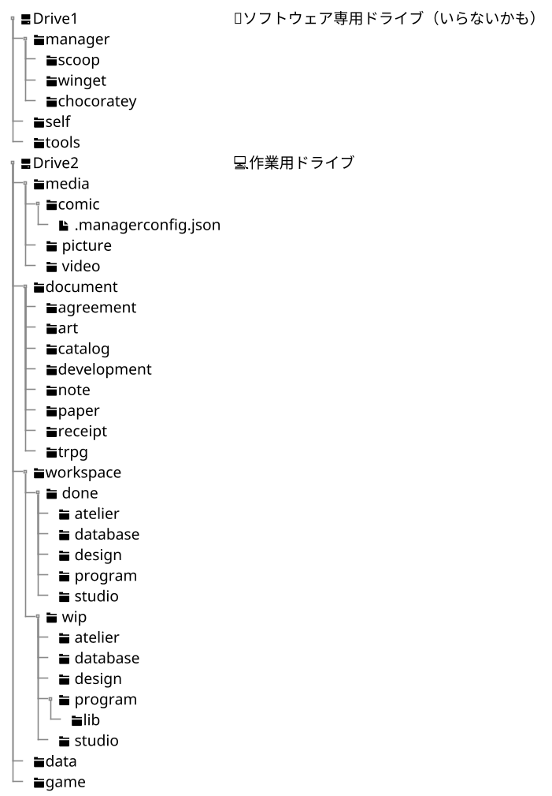

# 実環境構成

## 目次 👀

---

- [目次](#目次-)

## 現時点でのドライブ構成

---

@import ".\uml\current-directory.puml"

見ても分かる通り、かなり雑多で複雑な構成になっている。
自分は長い事この構成で生活をしてきたため、それなりにファイルなどの位置を把握しているが、それも完全ではない。
Xが提供しているAIの**Grok**へこれらの構成に対する所感を求めたところ下記のような回答が返ってきた。

---

- **Grokへ質問**

    ```cmd
    やあ、ディレクトリの構成を考えるために現在のディレクトリ構成を図化してみたんだけど、自分で見てもかなりひどいね。
    よかったらGrokも現在の僕のディレクトリ構成図を見てちょうだいよ。
    そんでよかったら、子階層まで見てもらって君なりの所見・感想を聞かせてほしいな。
    ```

- **Grokの回答**

    @import ".\ai-reference\grok-opinion-current-directory.md"

## 構想 🧠

---

### ドライブ構成 💾

- システムドライブ（OS）
- 作業用ドライブ
- バックアップドライブ（外付け）

### 1. システムドライブ（C:）

OSを配置するドライブ。
基本的にここには余計なファイルを置かないようにしたい。

### 2. 作業用ドライブ（D~Z:）

作業や適当なファイルを置いておくためのドライブ。
1つか2つ程度で構成したい。

### 3. バックアップドライブ

システム・作業用それぞれ独立してバックアップがとれるように構成したい。

### 作業用ドライブ

#### 各ドライブのディレクトリ構成



</br>

### ディレクトリの説明

---

#### 第一層

##### media 🎞️

メディアファイルを管理するディレクトリ
下層の構成は下記のとおり

- **picture**：画像ファイル
- **video**：動画ファイル
- **sound**：音声ファイル
- **book**：電子書籍（PDFを含む）

##### document 📄

カタログや論文、契約書などの書類を管理するディレクトリ
下層の構成は下記のとおり

- **agreement**：契約書
- **art**：絵画等の参考資料
- **catalog**：カタログ
- **paper**：論文
- **manual**：取扱説明書・マニュアル
- **receipt**：レシート・領収書
- **trpg**：テーブルゲームとそのサプリ

##### workspace 💼

作業用のディレクトリ
下層の構成は下記の通り

- `done`：完了済みのプロジェクト
- `wip`：作業中のプロジェクト

##### data

各種データ用のディレクトリ
JsonやCSV,データベースファイルの置き場所
下層の構成は下記の通り

- **do**：

##### game

ゲームフォルダなどを格納するためのディレクトリ
下層の構成は下記の通り

- **do**：

---

