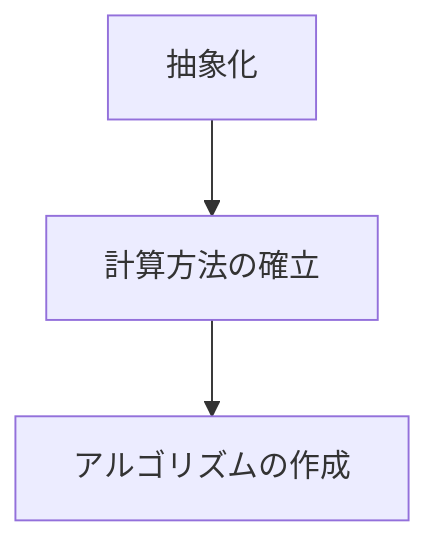
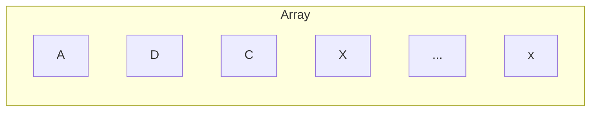
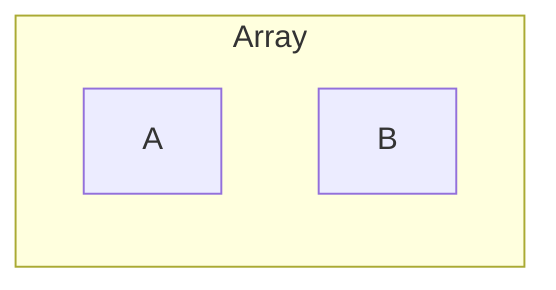

# Microsoft ExcelやGoogle SpreadsheetのA1表示における列名からの列数算出方法

## 🚀 最初に

---

`Microsoft Excel`や`Google Spreadsheet`といった表計算ソフトには**A1**表示と呼ばれる表示形式が存在する。
下記のように**A,B,C**と記載された列と**1,2,3**と記載された行からなる2次元の表である。

||A|B|C|...|
|:-:|:-:|:-:|:-:|:-:|
|1|||||
|2|||||
|3|||||

表計算において自動化は珍しくなく、勤勉な諸兄は`VBA`や`GAS`などを用いて自動化を試み、最適なソリューションを模索していると思う。
ただ、自動化において試行錯誤しているうち、壁に突き当たることがままあることだろう。
今回はその壁の一部にフォーカスを当てていきたく思う。

## ✨ 列名から列インデックスを算出したい

---

さてその課題であるが、ずばり

### 列名から列インデックスを取得したい

これに尽きる。
「なんだ、そんなの一度A1形式でRangeから取得すればいいじゃないか」と思うかもしれない。

### そんなのエレガントじゃない😭😭😭

わがままに聞こえるかもしれないが、エレガントさと汎用性、利便性を兼ね備えてこそのコードであると信じている。
実体に依存するコードは可能であれば書きたくないというのが性分だ。
ここはゆずれない。

ちなみに列名から列インデックスを取得したいというのは具体的に下記のような操作である。

ある関数 $ f(x) $　が存在したとき

\[
    f(x)
\]

その関数 $ f(x) $ は任意長のアルファベット（大文字）で構成された文字列を与えたとき任意の値を返すことができる。
下記に例を示す。

(例1)　AAA列
\[
    x :="AAA" \\
    f(x) = (1\times26^2)+(1\times26^1)+(1\times26^0)=703
\]

(例2)　GXFASSE列
\[
    x := "GXFASSE" \\
    f(x) = (7\times26^6)+(24\times26^5)+(6\times26^4)+(1\times26^3)+(19\times26^2)+(19\times26^1)+(5\times26^0) \\
    f(x) = 2450336231
\]


## 🛣️ 道のり

---



## 🎨 抽象化

---

ある配列`Array`を考える。



このとき、`Array`に入るのはA～Zまでの任意のアルファベットである（重複可）
簡単な例として、配列が**A,B**で構成されていたと仮定する。
その場合下記のような配列になる。



```typescript
const array: string = "AB";
```

計算を行ってみる
まずは下記のように定義を行う。
1～26までの自然数の集合を $ \mathbb{K} $とする。
\[
    \mathbb{K} = \{1, 2, 3, \ldots, 26\}
\]

またそれぞれの値はアルファベットのA-Zの全射である。

\[
    A = 1\\
    B = 2\\
    C = 3\\
    \vdots\\
    Z = 26\\
\]

Z(=26)を超える際、桁上がりが発生するため、2桁目をAにする。

\[
    Z + A = AA \rightarrow 26 + 1 = 27\\
    AA = 27
\]

ここで2の位へ上がるには27必要であることが分かった。
そのため、**AB**を計算するためには

\[
    Z + B = AB \rightarrow  26 + 2 = 28 \\
    AB = 28 \\
\]

上記や先の例題を見てわかったこととして、下記のように一般化可能である。

\[
    \sum_{n=0}^\infty 26^n
\]

[シグマ記号を用いた計算 リンク](https://www.cc.aoyama.ac.jp/~t41338/math/mathlecture/basics/sigma.html)

---

\[
    \mathbb{K} = \{X_1, X_2,X_3, \ldots, X_n\}となるような集合\mathbb{K}が存在した場合、 \\
    \\
    自然数の集合を\mathbb {N}として\mathbb{K} = \{(X, n) \mid 1 \leq X \leq 26, 1 \leq n \leq \mathbb{N} \} が成り立つとき \\
     \\
\]

\[
    
\]

