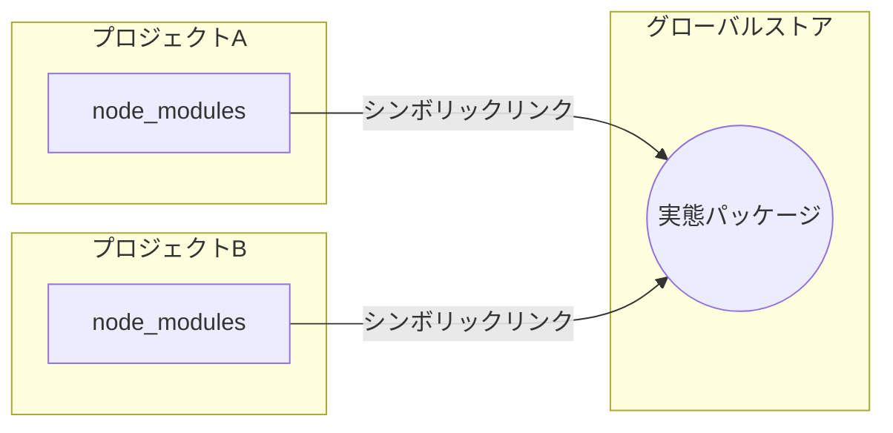

# JavaScriptのパッケージマネージャー

---

参考記事

* 【完全比較】npm vs pnpm vs Yarn vs Bun、最強のパッケージマネージャーはどれだ？ https://qiita.com/syukan3/items/0e3560bf0e2ae715f5d1
* JavaScriptパッケージ管理ツール「pnpm」の紹介 https://zenn.dev/cloud_ace/articles/articlejs-package-manager-pnpm

---

## 目次

- [JavaScriptのパッケージマネージャー](#javascriptのパッケージマネージャー)
  - [目次](#目次)
  - [パッケージマネージャーの種類](#パッケージマネージャーの種類)
  - [各種機能](#各種機能)
      - [◇ 依存関係アーキテクチャ図(pnpmの場合)](#-依存関係アーキテクチャ図pnpmの場合)
  - [性能（インストール速度・ディスク効率）](#性能インストール速度ディスク効率)

---

## パッケージマネージャーの種類

| 名称  |       呼称       |  初版  |      開発者       |
| :---: | :--------------: | :----: | :---------------: |
|  npm  |   エヌピーエヌ   | 2010年 | Issac Z. Schluter |
| yarn  |      ヤーン      | 2016年 |    Facebook社     |
| pnpm  | ピーエヌピーエム | 2017年 |   Zoltan Kochan   |
|  Bun  |       バン       | 2021年 |   Jarred Sumner   |

---

## 各種機能

* #### npm / yarn (Classic)
  * `node_modules`にパッケージをフラット配置し、`package-lock.json`や`yarn.lock`で依存を固定。
  * 多くの開発者やツールが想定する**従来型構造**でトラブルは少ないが、同じパッケージをプロジェクトごとに重複して保存しがち。
* #### Yarn (Plug'n'Play)
  * `node_modules`フォルダを原則作成せず、**.pnp.cjsファイル**経由で依存解決を行う独自方式。
  * ファイル数を激減できる一方、対応していないツールには追加設定が必要。
* #### pnpm
  * **グローバルストア**でパッケージを集中管理し、各プロジェクトの`node_modules`にはシンボリックリンクのみ配置。
  * **pnpm-lock.yaml**による決定論的な依存固定や、副作用キャッシュ（ネイティブアドオンのビルド成果物再利用）など実践的な機能が充実。
  * **npm互換**のコマンド体系でスクリプト実行や`pnpm audit`も可能。
* #### Bun
  * npm互換性を意識しつつ、**独自ランタイムに最適化**した実装。
  * ロックファイルとして`bun.lockb`を用意。**ビルド・テスト機能**も標準搭載し、開発フローを一体でカバー。

#### ◇ 依存関係アーキテクチャ図(pnpmの場合)

上図のように、**pnpm**はプロジェクトごとの`node_modules`フォルダに実ファイルを展開せず、シンボリッくリンクによって**一元的にキャッシュされたパッケージ**を参照します。

---

## 性能（インストール速度・ディスク効率）

* ### インストール速度
  * **npm**は最もシンプルな実装のため、やや遅い印象。
  * **yarn**は並列インストールやオフラインキャッシュによりnpmより高速化。
  * **pnpm**は一度インストールしたパッケージをグローバルストアで使いまわすため、**２回目以降のインストールが特に速い**。
  * **Bun**はマルチスレッドでのI.O処理により、理論上さ