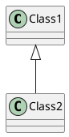

# JavaScriptのパッケージマネージャー

---

参考記事
* 【完全比較】npm vs pnpm vs Yarn vs Bun、最強のパッケージマネージャーはどれだ？ : https://qiita.com/syukan3/items/0e3560bf0e2ae715f5d1
* JavaScriptパッケージ管理ツール「pnpm」の紹介 : https://zenn.dev/cloud_ace/articles/articlejs-package-manager-pnpm

---

## パッケージマネージャーの種類

| 名称  |       呼称       |  初版  |      開発者       |
| :---: | :--------------: | :----: | :---------------: |
|  npm  |   エヌピーエヌ   | 2010年 | Issac Z. Schluter |
| yarn  |      ヤーン      | 2016年 |    Facebook社     |
| pnpm  | ピーエヌピーエム | 2017年 |   Zoltan Kochan   |
|  Bun  |       バン       | 2021年 |   Jarred Sumner   |

---

## 各種機能

* npm / yarn (Classic)
  * `node_modules`にパッケージをフラット配置し、`package-lock.json`や`yarn.lock`で依存を固定。
  * 標準機能の為、多くの開発者が利用しておりトラブルは少ないが、同じパッケージを重複して保存しがち。
* Yarn (Plug'n'Play)
  * `node_modules`フォルダを原則作成せず、`.pnp.cjs`ファイル経由で依存解決を行う独自方式。
  * ファイル数を激減できる一方、対応していないツールには追加設定が必要。
* pnpm
  * *グローバルストア*でパッケージを集中管理し、各プロジェクトの`node_modules`にはシンボリックリンクのみ配置。
  * *pnpm-lock.yaml*による決定論的な依存固定や、副作用キャッシュ（ネイティブアドオンのビルド成果物再利用）など実践的な機能が充実。
  * *npm互換*のコマンド体系でスクリプト実行や`pnpm audit`も可能。
* Bun
  * npm互換性を意識しつつ、*独自ランタイムに最適化*した実装。
  * ロックファイルとして`bun.lockb`を用意。*ビルド・テスト機能*も標準搭載し、開発フローを一体でカバー。

