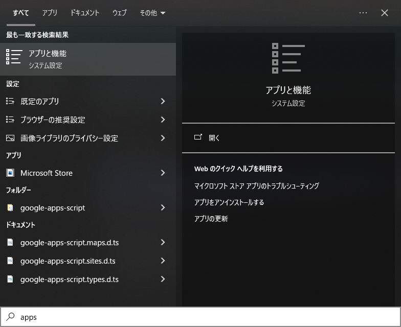

# トラブルシューティング

---

## 👀 目次

---

## 💣 実際に自分が当たったトラブル

---

### `python --version` と入力しても出力に**Python**としか出てこない

ちょうど運よくビッタな記事を見つけることができたので、ここに記す。

記事：[cmdでpythonコマンドが「Python」とだけ返すときの解決法](https://note.com/qk01yasu/n/n5c81d4706f91)

#### 要約すると
複数個所にPythonがあり、かつバージョンがバラバラであると表示できないようである。

記事にも解決方法が掲載されていたのだが、魚拓としてここにも記しておく。

#### 対処法

Pythonのバージョンを調べるため、`--version`で調べる。
```txt
> python --version
Python
```

通常なら`Python`の後にバージョン番号が表示されるが、表示されない。
しかし、**Python自体は表示されている**のでPCのどこかにはインストール済みであるということ。
Pythonがどこを参照しているのかを`where`コマンドで調査。

```txt
> where python
C:\Users\matsumura\AppData\Local\Microsoft\WindowsApps\python.exe
C:\Users\matsumura\AppData\Local\Programs\Python\Python312\python.exe
```

どうやら2箇所のpython.exeを参照していたようである。
面倒くさいので、全部アンインストールして、再度入れなおすことにする。

`windows + s`で検索窓を開き、**「アプリと機能」** または **「apps and feature」** と検索し開く。




アプリと機能欄の検索窓へ**python**と記入する。


表示されたすべてのPythonをアンインストールする(ランチャーも含む)


削除完了後、もう一度コマンドプロンプトにて`where python`を実行する。

```txt
> where python
C:\Users\matsumura\AppData\Local\Microsoft\WindowsApps\python.exe
```
全てアンインストールしたはずだが、まだ表示されている。
`python.exe`のすぐ上まで移動して、一度`python.exe`がどれだけ存在するかチェックする。

```txt
> cd C:\Users\matsumura\AppData\Local\Microsoft\WindowsApps
> dir *python*.exe
2024/06/20  07:46                 0 python.exe
2024/06/20  07:46                 0 python3.exe
               2 個のファイル                   0 バイト
               0 個のディレクトリ  44,785,668,096 バイトの空き領域
```

ファイルサイズが0byteの**python.exeとpython3.exe**が残ってしまっているため、先ほどの検索に引っかかってしまったようである。
このまま残していても、再インストール後に同じ轍を踏むことになるため`del`コマンドを使用してきっちりと削除しておく。

```txt
> del /Q *python*.exe
```

※ `/Q`はワイルドカードを用いた一括削除の際に確認のメッセージを表示しないようにするオプションである。

念のため`where python`
```txt
> where python
情報: 与えられたパターンのファイルが見つかりませんでした。
```

**これでおｋ🎉**
